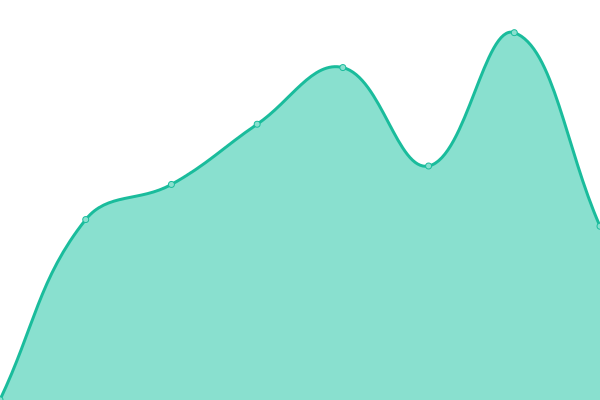

# [📈 Live Status](https://Ballaual.github.io/status): <!--live status--> **🟩 All systems operational**

This repository contains the open-source uptime monitor and status page for [Alexander Ballauf](ballaual.de), powered by [Upptime](https://github.com/upptime/upptime).

With [Upptime](https://upptime.js.org), you can get your own unlimited and free uptime monitor and status page, powered entirely by a GitHub repository. We use [Issues](https://github.com/Ballaual/status/issues) as incident reports, [Actions](https://github.com/Ballaual/status/actions) as uptime monitors, and [Pages](https://Ballaual.github.io/status) for the status page.

<!--start: status pages-->
<!-- This summary is generated by Upptime (https://github.com/upptime/upptime) -->
<!-- Do not edit this manually, your changes will be overwritten -->
<!-- prettier-ignore -->
| URL | Status | History | Response Time | Uptime |
| --- | ------ | ------- | ------------- | ------ |
|  [Froxlor](https://froxlor.ballaual.de/) | 🟩 Up | [froxlor.yml](https://github.com/Ballaual/status/commits/HEAD/history/froxlor.yml) | 

 462ms
     
 | 

<a href="https://Ballaual.github.io/status/history/froxlor">100.00%</a>
    

|  [Homepage](https://ballaual.de/) | 🟩 Up | [homepage.yml](https://github.com/Ballaual/status/commits/HEAD/history/homepage.yml) | 

 529ms
     
 | 

<a href="https://Ballaual.github.io/status/history/homepage">100.00%</a>
    

|  [Easy-Wi](https://ew.ballaual.de/) | 🟩 Up | [easy-wi.yml](https://github.com/Ballaual/status/commits/HEAD/history/easy-wi.yml) | 

 830ms
     
 | 

<a href="https://Ballaual.github.io/status/history/easy-wi">100.00%</a>
    

|  [Ark Server](88.198.15.44) | 🟩 Up | [ark-server.yml](https://github.com/Ballaual/status/commits/HEAD/history/ark-server.yml) | 

 93ms
     
 | 

<a href="https://Ballaual.github.io/status/history/ark-server">100.00%</a>
    

|  [Minecraft Server](88.198.15.44) | 🟩 Up | [minecraft-server.yml](https://github.com/Ballaual/status/commits/HEAD/history/minecraft-server.yml) | 

 91ms
     
 | 

<a href="https://Ballaual.github.io/status/history/minecraft-server">100.00%</a>
    

<!--end: status pages-->

[**Visit our status website →**](https://Ballaual.github.io/status)

## 📄 License

- Powered by: [Upptime](https://github.com/upptime/upptime)
- Code: [MIT](./LICENSE) © [Alexander Ballauf](ballaual.de)
- Data in the `./history` directory: [Open Database License](https://opendatacommons.org/licenses/odbl/1-0/)
