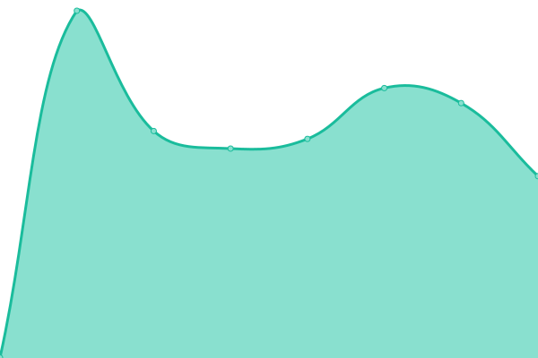

# [📈 Live Status](https://Ballaual.github.io/status): <!--live status--> **🟧 Partial outage**

This repository contains the open-source uptime monitor and status page for [Alexander Ballauf](ballaual.de), powered by [Upptime](https://github.com/upptime/upptime).

With [Upptime](https://upptime.js.org), you can get your own unlimited and free uptime monitor and status page, powered entirely by a GitHub repository. We use [Issues](https://github.com/Ballaual/status/issues) as incident reports, [Actions](https://github.com/Ballaual/status/actions) as uptime monitors, and [Pages](https://Ballaual.github.io/status) for the status page.

<!--start: status pages-->
<!-- This summary is generated by Upptime (https://github.com/upptime/upptime) -->
<!-- Do not edit this manually, your changes will be overwritten -->
<!-- prettier-ignore -->
| URL | Status | History | Response Time | Uptime |
| --- | ------ | ------- | ------------- | ------ |
|  [Froxlor](https://froxlor.ballaual.de/) | Online | [froxlor.yml](https://github.com/Ballaual/status/commits/HEAD/history/froxlor.yml) | 

 685ms
     
 | 

<a href="https://status.ballaual.de/history/froxlor">99.73%</a>
    

|  [Pterodactyl](https://gs.ballaual.de/) | Online | [pterodactyl.yml](https://github.com/Ballaual/status/commits/HEAD/history/pterodactyl.yml) | 

 1247ms
     
 | 

<a href="https://status.ballaual.de/history/pterodactyl">100.00%</a>
    

|  [Homepage](https://ballaual.de/) | Online | [homepage.yml](https://github.com/Ballaual/status/commits/HEAD/history/homepage.yml) | 

 660ms
     
 | 

<a href="https://status.ballaual.de/history/homepage">100.00%</a>
    

|  [Rspamd](https://ballaual.de/rspamd/) | Online | [rspamd.yml](https://github.com/Ballaual/status/commits/HEAD/history/rspamd.yml) | 

 250ms
     
 | 

<a href="https://status.ballaual.de/history/rspamd">100.00%</a>
    

|  [phpMyAdmin](https://ballaual.de/phpmyadmin/) | Online | [php-my-admin.yml](https://github.com/Ballaual/status/commits/HEAD/history/php-my-admin.yml) | 

 163ms
     
 | 

<a href="https://status.ballaual.de/history/php-my-admin">100.00%</a>
    

|  [Roundcube](https://ballaual.de/mail/) | Online | [roundcube.yml](https://github.com/Ballaual/status/commits/HEAD/history/roundcube.yml) | 

 147ms
     
 | 

<a href="https://status.ballaual.de/history/roundcube">100.00%</a>
    

|  [Ark](88.198.15.44) | Offline | [ark.yml](https://github.com/Ballaual/status/commits/HEAD/history/ark.yml) | 

 0ms
     
 | 

<a href="https://status.ballaual.de/history/ark">0.00%</a>
    

|  [Counter-strike](88.198.15.44) | Offline | [counter-strike.yml](https://github.com/Ballaual/status/commits/HEAD/history/counter-strike.yml) | 

 0ms
     
 | 

<a href="https://status.ballaual.de/history/counter-strike">100.00%</a>
    

|  [Icarus](88.198.15.44) | Offline | [icarus.yml](https://github.com/Ballaual/status/commits/HEAD/history/icarus.yml) | 

 0ms
     
 | 

<a href="https://status.ballaual.de/history/icarus">100.00%</a>
    

|  [Minecraft](88.198.15.44) | Offline | [minecraft.yml](https://github.com/Ballaual/status/commits/HEAD/history/minecraft.yml) | 

 0ms
     
 | 

<a href="https://status.ballaual.de/history/minecraft">0.00%</a>
    

|  [Palworld](88.198.15.44) | Offline | [palworld.yml](https://github.com/Ballaual/status/commits/HEAD/history/palworld.yml) | 

 0ms
     
 | 

<a href="https://status.ballaual.de/history/palworld">0.00%</a>
    

|  [Teamspeak](88.198.15.44) | Online | [teamspeak.yml](https://github.com/Ballaual/status/commits/HEAD/history/teamspeak.yml) | 

 671ms
     
 | 

<a href="https://status.ballaual.de/history/teamspeak">100.00%</a>
    

<!--end: status pages-->

[**Visit our status website →**](https://Ballaual.github.io/status)

## 📄 License

- Powered by: [Upptime](https://github.com/upptime/upptime)
- Code: [MIT](./LICENSE) © [Alexander Ballauf](ballaual.de)
- Data in the `./history` directory: [Open Database License](https://opendatacommons.org/licenses/odbl/1-0/)
